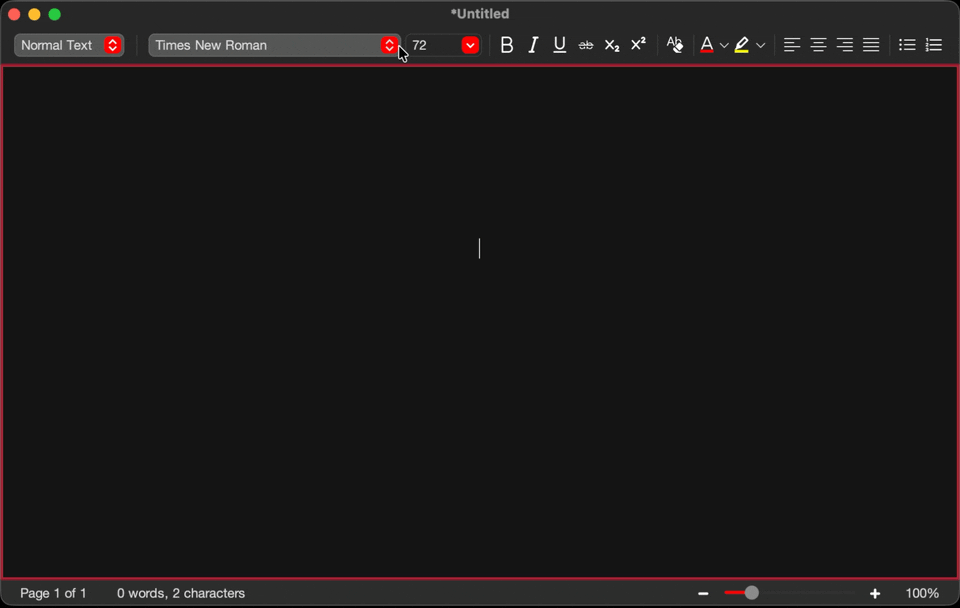

<!-- Source: https://github.com/othneildrew/Best-README-Template/ -->
<a id="readme-top"></a>
<!-- PROJECT LOGO -->
<br />
<div align="center">
  <a href="https://github.com/DiegoGomesDG/JTextEditor">
    
  </a>

<h3 align="center">JTextEditor</h3>

  <p align="center">
    A simplified rich-text editor built in Java using Swing,
    <br />
    <a href="https://github.com/DiegoGomesDG/JTextEditor/new?labels=bug&template=bug-report---.md">Report Bug</a>
    &middot;
    <a href="https://github.com/DiegoGomesDG/JTextEditor/issues/new?labels=enhancement&template=feature-request---.md">Request Feature</a>
  </p>
</div>

<!-- TABLE OF CONTENTS -->
<details>
  <summary>Table of Contents</summary>
  <ol>
    <li> <a href="#about-the-project">About The Project</a> </li>
    <li> <a href="#Features">Features</a> </li>
    <li>
      <a href="#getting-started">Getting Started</a>
      <ul>
        <li><a href="#prerequisites">Prerequisites</a></li>
        <li><a href="#installation">Installation</a></li>
      </ul>
    </li>
    <li><a href="#usage">Usage</a></li>
    <li><a href="#contributing">Contributing</a></li>
    <li><a href="#license">License</a></li>
  </ol>
</details>


<!-- ABOUT THE PROJECT -->
## 📄️ About The Project
<p align="center">
  
</p>
The Java Text Editor is a rich-text editing application written in Java, designed as a final project for the Programming 3 course at the Budapest University of Technology and Economics. The program showcases object-oriented programming, event-driven GUI design, and file management in Java.


It supports creating, editing, and formatting documents with features like bold, italic, underline, font customization, text alignment, and a Find tool for searching text. Users can also create, open, and save `.rtf` documents, while the status bar dynamically displays word and character counts.


The application leverages a Model-View-Controller (MVC) architecture, with a DocumentManager handling multiple open documents and ensuring clear separation between data, logic, and GUI.

## 🚀 Features
- **Rich Text Editing**
    - Bold, italic, underline
    - Font family and size selection
    - Text alignment and color customization
- **Document Management**
    - New, open, save `.rtf` documents
    - Multiple document windows
- **Find Tool**
    - Search for text within the document
    - Highlights all matches dynamically
- **Status Bar**
    - Real-time character and word count
    - Zoom slider for text scaling
## 📦 Getting Started

### 📋 Prerequisites
- Java 21 or higher
- Maven (for dependency management)
- JDK configured in your IDE or system PATH

### ⚙️ Installation
1. Clone the repository:
```bash
git clone https://github.com/DiegoGomesDG/JTextEditor.git
cd JavaTextEditor
```
2. Build the project with Maven:
```bash
mvn clean install
```
3. Run the application:
```bash
mvn exec:java -Dexec.mainClass="com.texteditor.TextEditor"
```

## 🛠️ Usage
### ✏️ Editing & Formatting
Open a document or create a new one, then select text to apply formatting. You can change font styles, colors, and alignment using the toolbar or menu options.

### 🔍 Find Tool
Use the Find option from the menu to search for words or phrases. All occurrences will be highlighted, making it easy to navigate large documents.

### 📂 Document Management
Create new documents, open existing `.rtf` files, and save your work. Multiple documents can be opened in separate windows simultaneously.

## 🤝 Contributing
Contributions are what make the open source community such an amazing place to learn, inspire, and create. Any contributions you make are **greatly appreciated**.

If you have a suggestion that would make this better, please fork the repo and create a pull request. You can also simply open an issue with the tag "enhancement".
Don't forget to give the project a star! Thanks again!

1. Fork the Project
2. Create your Feature Branch (`git checkout -b feature/AmazingFeature`)
3. Commit your Changes (`git commit -m 'Add some AmazingFeature'`)
4. Push to the Branch (`git push origin feature/AmazingFeature`)
5. Open a Pull Request

## 📄 License
Distributed under the MIT License. See `LICENSE.txt` for more information.

